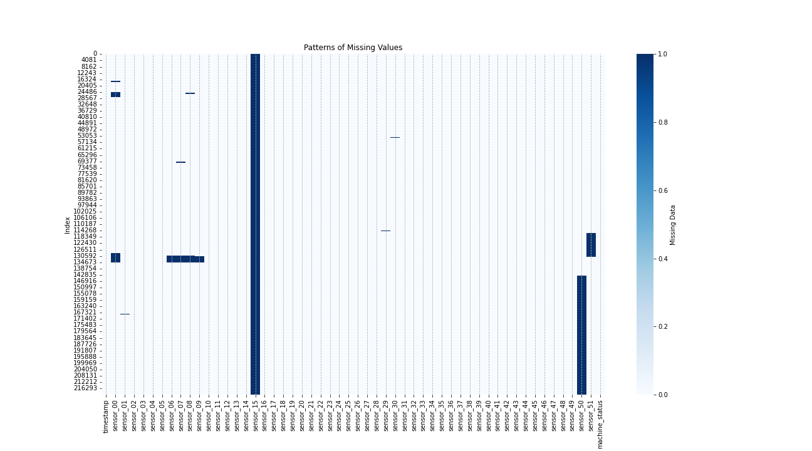

# Predictive Maintenance Project 

## About 
### The Project 

Time series data Long Short-Term Memory (LSTM) neural network used predict failure of a water pump to allow for timely maintenance. 

### RNNs Background

Recurrent Neural Networks (RRNs) account for the context and sequence of the data therefore suited for time series analysis. RRNs are trained using back propagation through time (BPTT) - an extension of backpropagation used in traditional feed-forward NNs.

RRNs are limited in the number of past time steps that can be remembered and susceptible to exploding and vanishing gradient due to recurrent flow of inputs through the network. Long Short-Term Memory (LSTM) neural networks are a type of RRN designed to address the vanishing gradient problem of RRNs and effectively handle extended sequences. LSTMs achieve this by having Gated Cells that have the ability to discard irrelevant information.

### The Data

The project uses a sensor dataset from Kaggle - [pump_sensor_data.](https://www.kaggle.com/datasets/nphantawee/pump-sensor-data/metadata) There are 52 sensors with a measurement made every minute for 220320 minutes (153 days). The `machine_status` column is the target feature to used as a predictor for machine breakdown. 

Feature Summary:
- Timestamps in 1-minute time steps
- 52 Sensors 
- Machine Status (Normal, Broken, Recovering) (target feature)

### The Model

### Built With

* Python version: 3.8.12
* Pandas version: 1.3.4
* Seaborn version: 0.11.2
* Sklearn version: 1.0.2
* Numpy version: 1.19.5
* Matplotlib version: 3.4.2
* Tensorflow version: 2.6.0

## Results

## Acknowledgements

The project uses a sensor dataset from Kaggle - [pump_sensor_data.](https://www.kaggle.com/datasets/nphantawee/pump-sensor-data/metadata)

For an introduction into RRNs [MIT's 6.S191 Lecture on RRNs](https://youtu.be/qjrad0V0uJE) has been a valuable resource.

The project has been heavily inspired by Jan Werth's article - [LSTM for Predictive Maintenance on Pump Sensor Data.](https://towardsdatascience.com/lstm-for-predictive-maintenance-on-pump-sensor-data-b43486eb3210)
